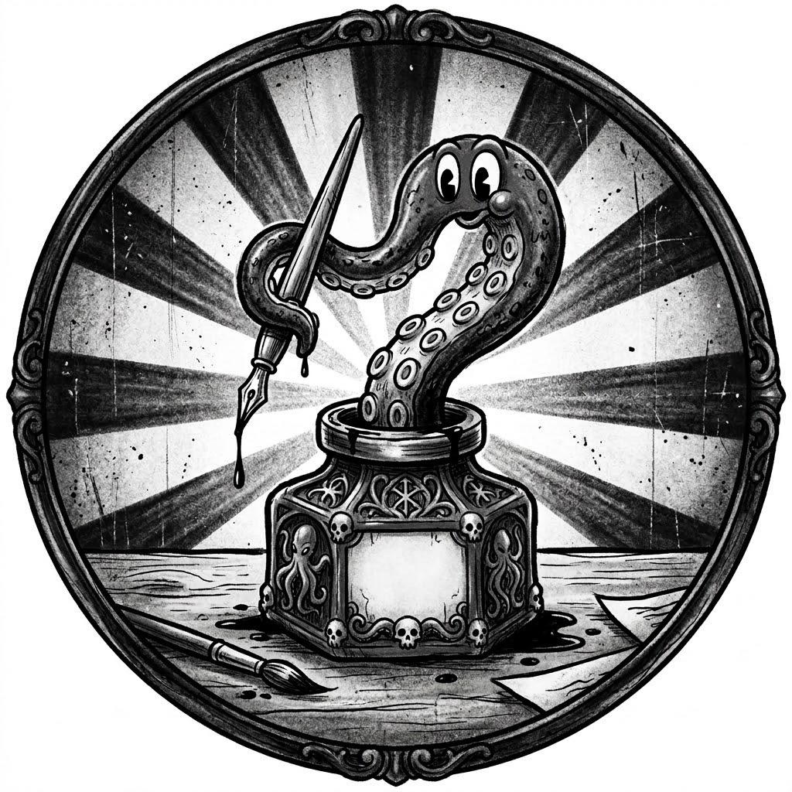
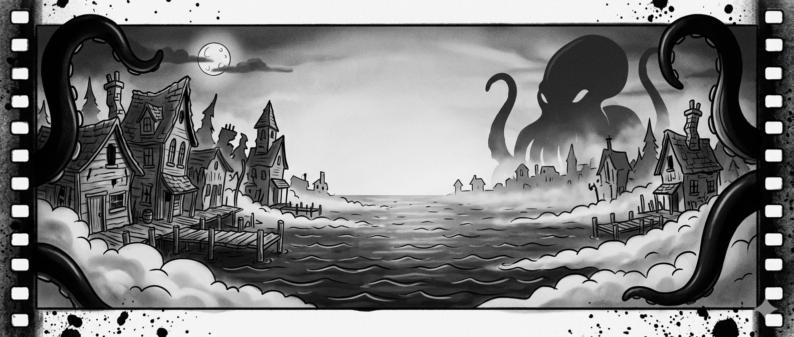
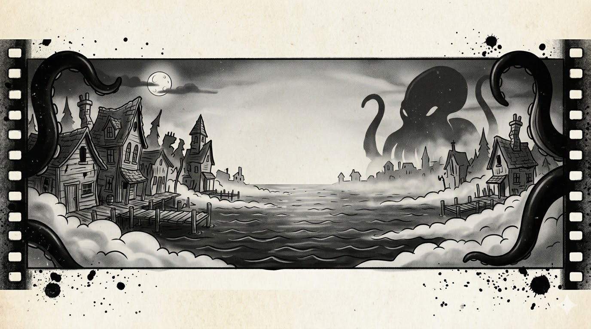

# Avatar

```
A vintage 1920s rubber-hose style cartoon illustration, monotone black and white, optimized for a circular YouTube profile picture. The central focus is an ornate, gothic animation inkwell. A single, highly stylized, rubbery Cthulhu tentacle is emerging from the neck of the inkwell, holding an antique animation dip pen. The lines are thick and bouncy. The background is a simple, dark, radiating starburst pattern, a classic motif from silent film title cards, centered behind the inkwell. The aesthetic is spooky, charming, and highly memorable, with heavy charcoal texture, film grain, and moody lighting. High contrast is key.

Do not include text.
```



# Banner

```
A wide, horizontal panoramic banner image designed for a YouTube channel titled 'Inkwell Innsmouth.' The aesthetic is vintage 1920s rubber-hose animation style, strictly black and white (monotone). The image depicts a dilapidated, gothic New England waterfront town (Innsmouth) at night. The buildings are warped, spooky, and sagging, drawn with bouncy, elastic, heavy black lines. Thick fog rolls off a dark, murky ocean with rubbery ripples. In the background, looming subtly over the foggy cityscape, is the colossal, stylized silhouette of a Cthulhu-like entity, its massive tentacles framing the scene. The composition must have a clear 'safe area' in the central third of the image, relatively sparse and clear of complex details, intended for future channel name text placement. The edges of the banner feature heavy ink blot textures and old film strip sprocket holes. High contrast, moody lighting, heavy film grain, and charcoal textures. The overall impression is spooky yet charming.

Must be 2048 x 1152 pixels
```





# Watermark

```
A vintage 1920s rubber-hose style cartoon illustration, monotone black and white, suitable for a tiny YouTube video watermark (PNG format). The central focus is an ultra-simplified, very bold, highly iconic representation of the ornate, gothic animation inkwell from the avatar. From the neck of the inkwell, a single, clear, rubbery Cthulhu tentacle is emerging, curled, holding an old-fashioned animation dip pen. The lines are extremely clean, thick, and bouncy, designed for maximum clarity at minuscule dimensions (like 150x150 pixels). The background is solid, clean, pure white, intended to be easily removed for transparency. There are no gradients, shadows, or complex radiating patterns. High contrast, clean edges, simplified form, high memorability.

Must be 150x150px.
```


